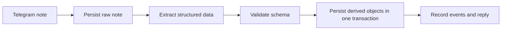
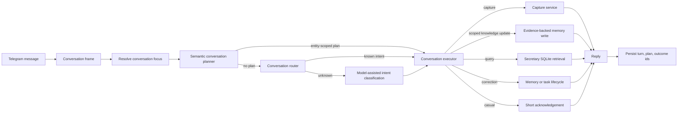

# Architecture

## Principle

MemoCore is a personal secretary backend. Raw evidence, interpreted memory, operational state, and
user-visible actions are separate by design.

Telegram is the first adapter, not the product boundary.

## Layers

| Layer | Responsibility |
| --- | --- |
| Adapters | Telegram, LLM providers, SQLite runtime, future external tools |
| Services | Capture, extraction, conversation routing, memory lifecycle, reminders, secretary views, events |
| Domain | Typed notes, tasks, reminders, meetings, follow-ups, commitments, projects, people, organizations, decisions, memory, events, schemas |
| Storage | Repositories, transactions, indexes, migrations |

## Capture Flow



Raw notes are stored before model calls. A repeated Telegram source message returns the existing
capture instead of duplicating work.

## Conversation Flow

Incoming Telegram text first becomes a bounded `ConversationFrame`: recent user and assistant
turns, current focus, pending clarification, visible task references, and the artifacts produced by
the previous turn. `ConversationPlanner` resolves high-risk multi-turn goals before the legacy
router, so corrections operate on exact artifacts instead of reparsing isolated words.



`ConversationComposer` owns shared prompts and confirmations. `ConversationService` is the
compatibility orchestrator while legacy branches move behind Router, Planner, Context Resolver,
Executor, and Composer boundaries.

Every handled chat turn records both sides of the exchange, the semantic plan when one exists, and
the affected entity ids. Model-assisted intent classification receives this bounded frame rather
than an isolated message or an unbounded transcript. Corrections such as “hai task vừa tạo là một
việc” can therefore reference the artifacts produced by the previous turn.

Schedule semantics live in `ScheduleSemantics`. A task may carry `duration_minutes`, so a range
such as 06:00–07:30 survives persistence and recurring occurrence creation. Multi-operation
corrections such as task merge execute in one database transaction with an audit event.

`ActivityReconciliationService` owns identity across task and meeting projections of the same
real-world activity. `activity_links` is persisted at capture time. A rename therefore updates the
task, its linked meeting title, person/project links, audit snapshot, and undo path atomically.
Legacy rename events are replayed through the same service at startup, so data repair does not use
one-off record patches.

Read-only routing is owned by `QueryExecutor`; durable task changes by `TaskMutationExecutor`;
memory corrections, scoped writes and rollback by `MemoryLifecycleExecutor`; and clarification
fallbacks by `ClarificationWorkflow`. The generic executor remains the allow-listed dispatch
primitive.

Deterministic routes are preferred for high-frequency queries and sensitive mutations. Model
classification is a fallback for less obvious language, and low-confidence write intents should ask
for clarification instead of mutating durable state.

Entity-scoped knowledge updates preserve the raw source note, split explicit list payloads into
separate memory claims, attach the canonical person/project id, and keep the entity as the current
conversation focus. They do not depend on model extraction when the user's update instruction and
payload are explicit.

Typed contextual references such as `dự án này` are resolved before scanning message text for
entity names. This prevents ordinary words such as `nghĩa là` from fuzzy-matching a person named
Nghĩa. A knowledge update is also treated as one reversible batch through its source note, so
“xóa 3 thông tin vừa cập nhật” removes only that batch and leaves unrelated memory untouched.

## Model Boundary

`ExtractionService` and `IntentClassifierService` own prompt construction. Providers implement:

```python
chat(ChatRequest) -> ChatResponse
```

Fallback applies to request failures and invalid model output. Relative dates are resolved in
Python before prompt construction.

## Storage Direction

SQLite is the verified runtime. It supports:

- raw notes and source idempotency;
- tasks, reminders, projects, people, meetings, follow-ups, and commitments;
- person/project links for operational context and meeting preparation;
- first-class organizations and source-linked decisions;
- source-linked person–organization–project relationships;
- decision lifecycle (`proposed`, `decided`, `superseded`) with replacement links;
- memory items with lifecycle status;
- conflict-marked memory candidates and an explicit canonical-memory link;
- event logs for auditability;
- explicit task-meeting activity links for mutation reconciliation and agenda de-duplication;
- packaged schema bootstrap and migrations.

PostgreSQL plus `pgvector` remains a blueprint for future retrieval, concurrency, backup, and
deployment needs. Do not claim production PostgreSQL support until a runtime adapter and contract
tests exist.

## Runtime Direction

The primary live runtime is the Windows PC. The Telegram bot should run through the PM2 process
`memocore-ste` as a single polling instance. `memocore doctor` is the preflight boundary for
configuration, provider settings, SQLite integrity, Telegram command registration, runtime data,
and PM2 state. See [Windows Runtime Guide](windows-runtime.md).

## Agent Harness Direction

The current extraction and conversation paths are narrow harnesses: they manage bounded context,
provider calls, validation, retries, fallback, transactional persistence, and audit events.

Future calendar, email, file, and worker capabilities should use a broader audited harness rather
than calling external systems directly. See [Agent Harness Direction](agent-harness.md).

These capabilities remain held until the gates in
[Conversation Stability Gates](conversation-stability-gates.md) pass in both automated transcript
evaluation and real Telegram usage.

## Canonical Knowledge

Conflicting claims are preserved with their raw source and confidence. They are excluded from
normal knowledge answers until review. The memory review inbox exposes both candidates and lets the
user select the canonical claim; losing claims become `superseded` and point to that canonical
memory. Explicit correction language may still supersede immediately because user intent is clear.
