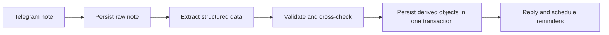

# Architecture

## Principle

Memocore is a personal secretary backend with Telegram as its first input adapter. Raw evidence, interpreted memory, operational state, and user-visible actions remain distinct.

## Layers

| Layer | Responsibility |
|---|---|
| Adapters | Telegram, LLM providers, SQLite runtime, future PostgreSQL runtime |
| Services | Capture, extraction, memory lifecycle, reminders, secretary views, events |
| Domain | Typed notes, tasks, reminders, meetings, follow-ups, projects, people, memory, events |
| Storage | Repositories, transactions, indexes, migrations |

## Capture Flow

Raw notes are stored before model calls. A repeated Telegram source message returns the prior capture rather than duplicating work.

## Model Boundary

`ExtractionService` builds prompt messages and validates `NoteExtraction`. Providers implement `chat(ChatRequest) -> ChatResponse`. The provider factory selects Ollama or an OpenAI-compatible endpoint from configuration.

Fallback applies to request failures and invalid model output. Relative weekday dates are calculated in Python before prompting.

## Reminder Safety

Reminder workers claim due rows with a lease before sending. This prevents immediate duplicate delivery when multiple workers poll concurrently. PostgreSQL migration should use row locking for stronger multi-worker guarantees.

## Storage Direction

SQLite is the current verified local runtime. PostgreSQL with pgvector is the long-distance target:

- transactions and concurrent workers;
- remote backup and restore;
- `JSONB` for flexible metadata;
- full-text search;
- vector embeddings for hybrid memory retrieval.

Graph relations should begin as relational link tables. A separate graph database is deferred until measurements justify it.
