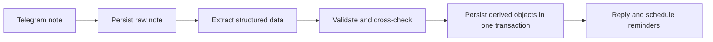
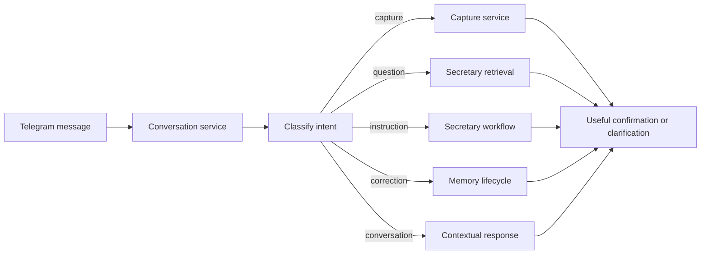

# Architecture

## Principle

Memocore is a personal secretary backend with Telegram as its first input adapter. Raw evidence, interpreted memory, operational state, and user-visible actions remain distinct.

## Layers

| Layer | Responsibility |
|---|---|
| Adapters | Telegram, LLM providers, SQLite runtime, future PostgreSQL runtime |
| Services | Capture, extraction, memory lifecycle, reminders, secretary views, events |
| Domain | Typed notes, tasks, reminders, meetings, follow-ups, projects, people, memory, events |
| Storage | Repositories, transactions, indexes, migrations |

## Capture Flow

Raw notes are stored before model calls. A repeated Telegram source message returns the prior capture rather than duplicating work.

## Conversation Direction

Telegram must evolve from a capture-only adapter into a conversational secretary interface.
Incoming messages should pass through a conversation service that classifies intent before
choosing a workflow.

Conversation context should be bounded and operational. Durable facts, commitments, and
preferences belong in managed storage rather than raw chat history.

## Model Boundary

`ExtractionService` builds prompt messages and validates `NoteExtraction`. Providers implement `chat(ChatRequest) -> ChatResponse`. The provider factory selects Ollama or an OpenAI-compatible endpoint from configuration.

Fallback applies to request failures and invalid model output. Relative weekday dates are calculated in Python before prompting.

## Agent Harness Direction

The current extraction path is a narrow harness: it manages prompt context, provider calls,
validation, retries, fallback, transactional persistence, and audit events. Future calendar,
email, file, and specialist-worker capabilities must use a broader agent harness rather than
calling external systems directly.

Grow the harness incrementally with secretary workflows. Start with a minimal audited boundary
for read-only calendar access. Add approval records, idempotency controls, and post-action
verification before write-capable calendar or email tools. Generalized bounded worker support
comes later. Free-form autonomous execution remains deferred.

See [agent harness direction](agent-harness.md).

## Reminder Safety

Reminder workers claim due rows with a lease before sending. This prevents immediate duplicate delivery when multiple workers poll concurrently. PostgreSQL migration should use row locking for stronger multi-worker guarantees.

## Storage Direction

SQLite is the current verified local runtime. PostgreSQL with pgvector remains a possible
long-distance target:

- transactions and concurrent workers;
- remote backup and restore;
- `JSONB` for flexible metadata;
- full-text search;
- vector embeddings for hybrid memory retrieval.

Start with structured SQLite retrieval. Add full-text search, PostgreSQL, and pgvector after
measured secretary workflows demonstrate a retrieval, concurrency, backup, or deployment need.

Graph relations should begin as relational link tables. A separate graph database is deferred until measurements justify it.
